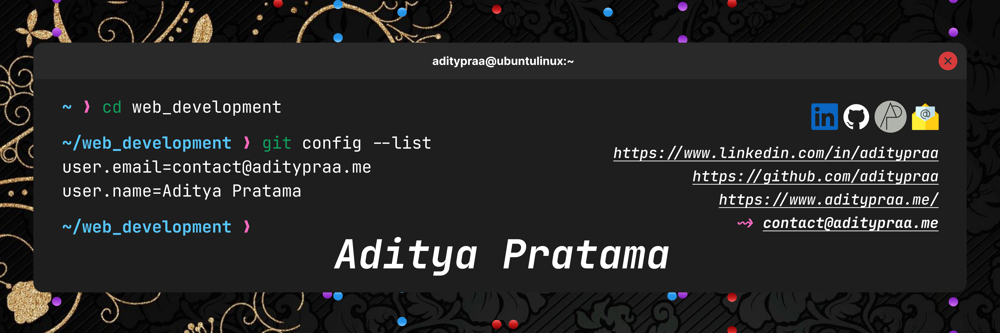
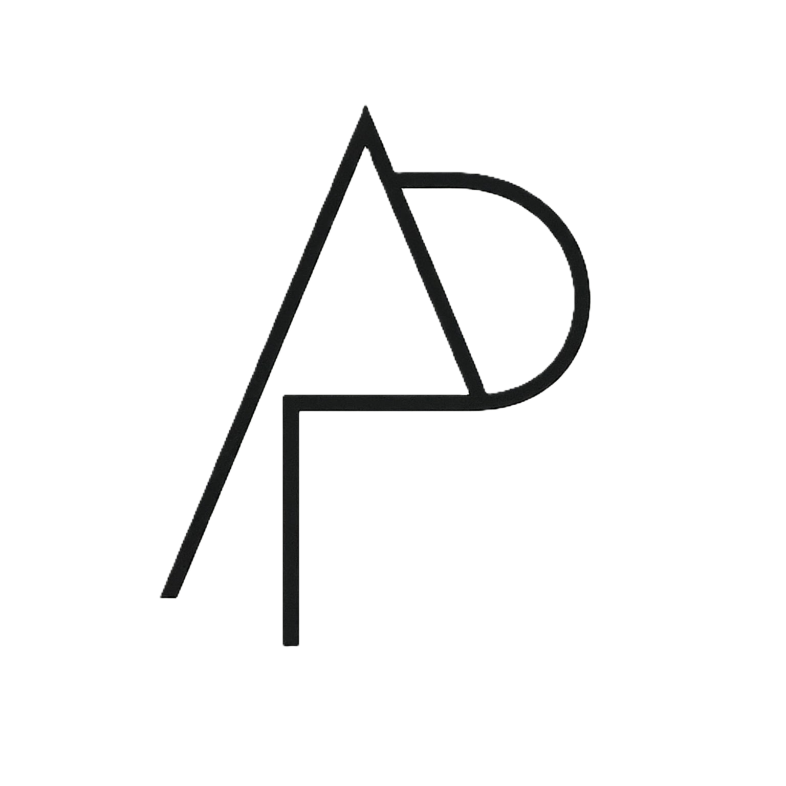

# Hi there! I'm Aditya Pratama 👋

### 🚀 Full Stack Developer | 💻 Tech Enthusiast | 🌟 Problem Solver

---

## 🚀 About Me

<table>
<tr>
<td valign="top" width="50%">

### 👨‍💻 Current Focus

- 🔭 Working on **Full Stack Web Development Projects**
- 🌱 Learning **Cloud Technologies & DevOps**
- 👯 Open to collaborate on **Open Source Projects**
- 💬 Ask me about **React, Node.js, NextJs, Full Stack Development & Cloud Tech**
- ⚡ Fun fact: **I love coding, problem solving, and turning coffee into code! ☕**
- 🎮 Hobbies: **Gaming, Tech Reviews, and Open Source Contributing**

### 📫 How to reach me

- 📧 Email: **contact@aditypraa.me**
- 🌐 Portfolio: **https://www.aditypraa.me**

</td>
<td valign="top" width="50%">

  

### 🎯 Goals for 2025

- 🚀 Master Cloud Technologies (AWS, Azure, GCP)
- 📱 Build mobile applications with React Native
- 🤝 Contribute to major open source projects
- 📝 Start technical blogging and content creation
- 🌐 Launch personal SaaS project
- 🎓 Learn AI/ML fundamentals

</td>
</tr>
</table>

---

## 🔥 GitHub Stats

### 📈 Contribution Graph

---

## 🛠️ Tech Stack & Tools

### Frontend Technologies

### Backend Technologies

### Tools & Platforms

---

## 🏆 GitHub Trophies

---

## 🔗 Connect with Me

---

## 🚀 Featured Projects

<table>
<tr>
<td width="50%">

### 🌟 Project Showcase

</td>
<td width="50%">

### 💡 Latest Work

</td>
</tr>
</table>

---

## 💭 Random Dev Quote

---

**"Code is like humor. When you have to explain it, it's bad." - Cory House**

**Thanks for visiting! ⭐ Star some repositories if you found them interesting!**

---

💙 Made with love by [Aditya Pratama](https://github.com/Aditypraa) | Last updated: May 2025

